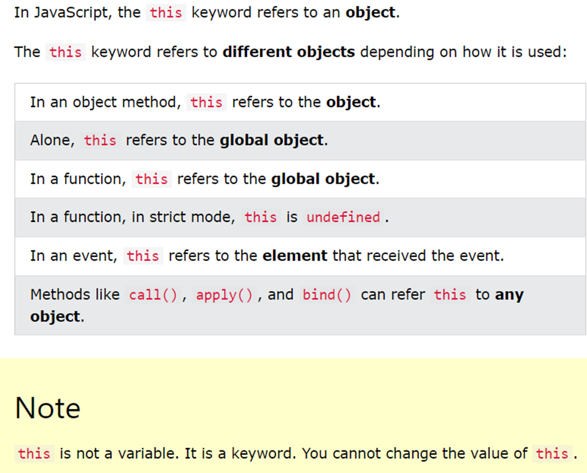

 
 1. [Heading 1](#heading-1)  
	1.1. [Explain 'this' in various modes](#subheading-11)  
	1.2. [Sub heading 12](#subheading-12)  
 	1.3. [Sub heading 13](#subheading-13)  
 2. [Heading 2](#heading-2)  
  	2.1. [Sub heading 21](#subheading-21)  
 	2.2. [Sub heading 22](#subheading-22)  
  	2.3. [Sub heading 23](#subheading-23)  
 3. [Heading 3](#heading-3)  
	3.1. [Sub heading 31](#subheading-31)  
  	3.2. [Sub heading 32](#subheading-32)  
  	3.3. [Sub heading 33](#subheading-33)  

 # Heading 1
 ## Subheading 11 
 ## What does 'this' refers to ?

 ## Subheading 12
 Content of the subheading 12
 ## Subheading 13
 Content of the subheading 13
 # Heading 2
 Content of the heading 2
 ## Subheading 21
 Content of the subheading 21
 ## Subheading 22
 Content of the subheading 22
 ## Subheading 23
 Content of the subheading 23
 # Heading 3
 Content of the heading 3
 ## Subheading 31
 Content of the subheading 31
 ## Subheading 32
 Content of the subheading 32
 ## Subheading 33
 Content of the subheading 33
