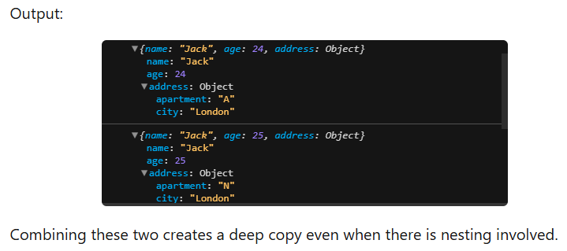
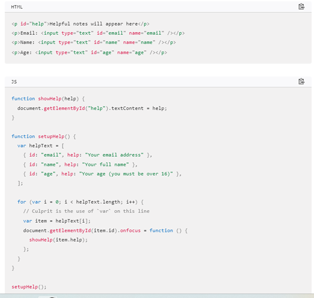

1.  [all-JavaScript](#all-javascript) <br/>
    1.1. [What does 'this' refers to?](#subheading-11) <br/>
    1.2. [Explain  call() , apply() & bind()?](#subheading-12) <br/>
    1.3. [ES6 New Feature : Spread Operator, Rest Operator & Destructuring](#subheading-13) <br/>
    1.4. [Shallow vs Deep Copy](#subheading-14) <br/><br/>
2.  [all-React](#all-react) <br/>
    2.1. [Sub heading 21](#subheading-21) <br/>
    2.2. [How will you update state based on previous state ?](#subheading-22) <br/>
    2.3. [Will you update or mutate react state?](#subheading-23) <br/>
    2.4. [What can we put in componentWillUnmount?](#subheading-24) <br/><br/>
3.  [all-HTML](#all-html) <br/>
    3.1. [Sub heading 31](#subheading-31) <br/>
    3.2. [Sub heading 32](#subheading-32) <br/>
    3.3. [Sub heading 33](#subheading-33) <br/><br/>
4.  [all-sort](#all-sort) <br/>
    4.1. [Sub heading 41](#subheading-41) <br/>
    4.2. [Sub heading 42](#subheading-42) <br/>
    4.3. [Sub heading 43](#subheading-43) <br/>
    4.3. [Sub heading 44](#subheading-44) <br/>

---
# all-JavaScript
## Subheading 11
### What does 'this' refers to ?

<details>

```javascript
const element = <h1>Hello, JSX!</h1>;
```

<b>Last point v.imp!</b>


</details>
______________________________________________________________________

## Subheading 12
### Explain  call() , apply() & bind() ?

<details>

```javascript
const element = <h1>Hello, JSX!</h1>;
```

### Note: They don't work with arrow functions!

Call method 


Apply method


Bind method


</details>
______________________________________________________________________

## Subheading 13
### ES6 New Feature : Spread Operator, Rest Operator & Destructuring

<details>

```javascript
const element = <h1>Hello, JSX!</h1>;
```
Spread operator


numbersCombined will be [1, 2, 3, 4, 5, 6]


Rest Operator


</details>
______________________________________________________________________

## Subheading 14
###  Shallow vs Deep Copy

<details>

```javascript
const element = <h1>Hello, JSX!</h1>;
```

# Shallow Copy


# Deep Copy for non-nested objects




## Full proof way to Deep copy 

### structuredClone() global function <br/>

(except non-serializable objects, for example, functions (with closures), Symbols, objects that represent HTML elements in the HTML DOM API, recursive data, and many other cases.)


</details>

______________________________________________________________________

## Subheading 15
### Array Methods - toDo

<details>

```javascript
const element = <h1>Hello, JSX!</h1>;
```


</details>

______________________________________________________________________

## Subheading 16
### String Methods - toDo

<details>

```javascript
const element = <h1>Hello, JSX!</h1>;
```

Answer!

</details>

______________________________________________________________________

## Subheading 17
### Closures

<details>

```javascript
const element = <h1>Hello, JSX!</h1>;
```

A closure gives a function access to its outer scope. 

In other words, a closure is the combination of a function enclosed with references to its surrounding state i.e. the lexical environment. 

### What is lexical scoping in closures?


The console.log() statement within the displayName() function successfully displays the value of the name variable, which is declared in its parent function. 

This is an example of lexical scoping.

Nested functions have access to variables declared in their outer scope.

## Will the following work as expected or not?



No matter what field you focus, only the message about your age will be displayed!! 

Reason:


## How to solve this bug ?

Solution: You have to use the let or const keyword instead of var.


</details>
______________________________________________________________________


## Subheading 18
### What's the diff. b/n arrow & ES5 function?

<details>


### 1. Call apply bind work with ES5 functions but not arrow functions;


### 2.	“arguments” object works only inside ES5 function while "spread operator" works only inside Arrow function


### 2. ES5 function can be accessed before they are declared  but not Arrow function.


### 3. this value ES5 function has its own 'this' but Arrow function don't.

Regular functions have their own this context. Depends on how you call or execute the function.

Arrow functions, do not have their own this context. They capture the this value from the surrounding lexical context in which the arrow function was created.


### 4. Prototype property by default existis for ES5 function but not for Arrow function.

Any function declared in JS except Arrow functions have a default property called prototype. 
Accessing prototype of an arrow function gives undefined as below,


### By default, the prototype of any function's (ES5 only) prototype property is Object.prototype  

### Object.prototype.__proto__ is null 

</details>
______________________________________________________________________


---

# all-React

## Subheading 21
### Question?

<details>

```javascript
const element = <h1>Hello, JSX!</h1>;
```

Answer!

</details>
______________________________________________________________________

## Subheading 22
### How will you update state based on previous state ?

<details>

```javascript
const element = <h1>Hello, JSX!</h1>;
```

Since state is considered read only so you should replace it with a new updated state, rather than mutate your existing object.  

Wrong: setAge(age+1)  
Correct: setAge(prevAge => prevAge + 1)  

</details>
______________________________________________________________________


## Subheading 23
### Will you update or mutate react state? 

<details>

```javascript
const element = <h1>Hello, JSX!</h1>;
```

Since state is considered read only so you should replace it with a new updated state, rather than mutate your existing object.  


</details>

## Subheading 24
### What can we put in componentWillUnmount?

<details>

```javascript
const element = <h1>Hello, JSX!</h1>;
```

This is called just before a component is removed from the DOM. It's a crucial place to perform cleanup tasks, such as clearing timers, unsubscribing from events, or releasing resources to prevent memory leaks. 

</details>
______________________________________________________________________

______________________________________________________________________

---

# all-HTML

## Subheading 31
### Question?

<details>

```javascript
const element = <h1>Hello, JSX!</h1>;
```

Answer!

</details>
______________________________________________________________________

## Subheading 32
### Question?

<details>

```javascript
const element = <h1>Hello, JSX!</h1>;
```

Answer!

</details>
______________________________________________________________________

## Subheading 33
### Question?

<details>

```javascript
const element = <h1>Hello, JSX!</h1>;
```

Answer!

</details>
______________________________________________________________________

---

# all-sort

## Subheading 41
### Question?

<details>

```javascript
const element = <h1>Hello, JSX!</h1>;
```

Answer!

</details>
______________________________________________________________________

## Subheading 42
### Question?

<details>

```javascript
const element = <h1>Hello, JSX!</h1>;
```

Answer!

</details>
______________________________________________________________________

## Subheading 43
### Question?

<details>

```javascript
const element = <h1>Hello, JSX!</h1>;
```

Answer!

</details>
______________________________________________________________________

---

## Subheading 
### Question?

<details>

```javascript
const element = <h1>Hello, JSX!</h1>;
```

Answer!

</details>
______________________________________________________________________
