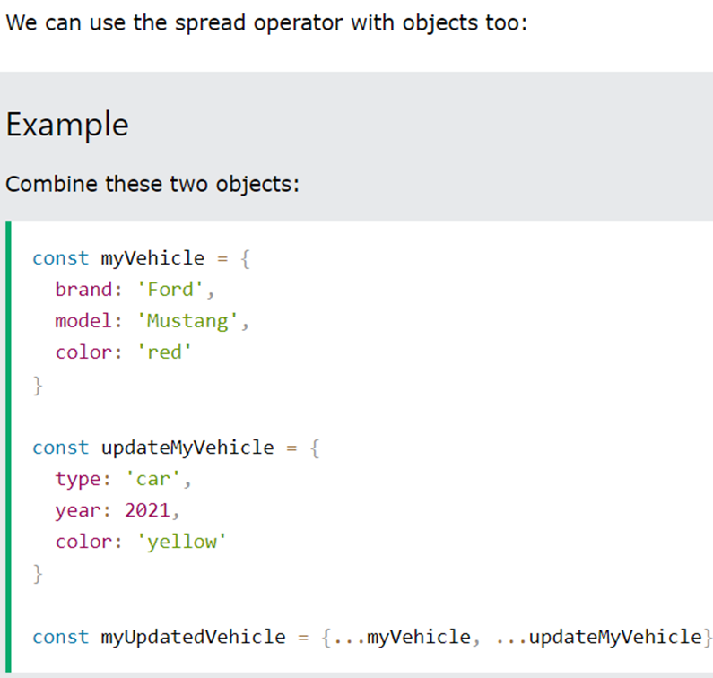

1.  [all-JavaScript](#all-javascript) <br/>
    1.1. [What does 'this' refers to](#subheading-11) <br/>
    1.2. [Sub heading 12](#subheading-12) <br/>
    1.3. [Sub heading 13](#subheading-13) <br/><br/>
2.  [all-React](#all-react) <br/>
    2.1. [Sub heading 21](#subheading-21) <br/>
    2.2. [Sub heading 22](#subheading-22) <br/>
    2.3. [Sub heading 23](#subheading-23) <br/><br/>
3.  [all-HTML](#all-html) <br/>
    3.1. [Sub heading 31](#subheading-31) <br/>
    3.2. [Sub heading 32](#subheading-32) <br/>
    3.3. [Sub heading 33](#subheading-33) <br/><br/>
4.  [all-sort](#all-sort) <br/>
    3.1. [Sub heading 31](#subheading-31) <br/>
    3.2. [Sub heading 32](#subheading-32) <br/>
    3.3. [Sub heading 33](#subheading-33) <br/>
    3.3. [Sub heading 34](#subheading-34) <br/>

---
# all-JavaScript
## Subheading 11
### What does 'this' refers to ?

<details>

```javascript
const element = <h1>Hello, JSX!</h1>;
```

<b>Last point v.imp!</b>


</details>
______________________________________________________________________

## Subheading 12
### Explain  call() , apply() & bind() ?

<details>

```javascript
const element = <h1>Hello, JSX!</h1>;
```
Call method


Apply method


Bind method


</details>
______________________________________________________________________

## Subheading 13
### Spread Operator, Rest Operator & Destructuring

<details>

```javascript
const element = <h1>Hello, JSX!</h1>;
```
Spread operator


numbersCombined will be [1, 2, 3, 4, 5, 6]




Rest Operator


</details>
______________________________________________________________________

## Subheading 14
###  Shallow vs Deep Copy

<details>

```javascript
const element = <h1>Hello, JSX!</h1>;
```

# Shallow Copy


# Deep Copy for non-nested objects


## Full proof way to Deep copy 

### structuredClone() global function <br/>

(except non-serializable objects, for example, functions (with closures), Symbols, objects that represent HTML elements in the HTML DOM API, recursive data, and many other cases.)


</details>
______________________________________________________________________

## Subheading 15
### Question?

<details>

```javascript
const element = <h1>Hello, JSX!</h1>;
```

Answer!

</details>
______________________________________________________________________

---

# all-React

## Subheading 21
### Question?

<details>

```javascript
const element = <h1>Hello, JSX!</h1>;
```

Answer!

</details>
______________________________________________________________________

## Subheading 22
### How will you update state based on previous state ?

<details>

```javascript
const element = <h1>Hello, JSX!</h1>;
```

Since state is considered read only so you should replace it with a new updated state, rather than mutate your existing object.  

Wrong: setAge(age+1)  
Correct: setAge(prevAge => prevAge + 1)  

</details>
______________________________________________________________________


## Subheading 23
### Will you update or mutate react state? 

<details>

```javascript
const element = <h1>Hello, JSX!</h1>;
```

Since state is considered read only so you should replace it with a new updated state, rather than mutate your existing object.  


</details>

## Subheading 24
### What can we put in componentWillUnmount?

<details>

```javascript
const element = <h1>Hello, JSX!</h1>;
```

This is called just before a component is removed from the DOM. It's a crucial place to perform cleanup tasks, such as clearing timers, unsubscribing from events, or releasing resources to prevent memory leaks. 

</details>
______________________________________________________________________

______________________________________________________________________

---

# all-HTML

## Subheading 31
### Question?

<details>

```javascript
const element = <h1>Hello, JSX!</h1>;
```

Answer!

</details>
______________________________________________________________________

## Subheading 32
### Question?

<details>

```javascript
const element = <h1>Hello, JSX!</h1>;
```

Answer!

</details>
______________________________________________________________________

## Subheading 33
### Question?

<details>

```javascript
const element = <h1>Hello, JSX!</h1>;
```

Answer!

</details>
______________________________________________________________________

---

# all-sort

## Subheading 41
### Question?

<details>

```javascript
const element = <h1>Hello, JSX!</h1>;
```

Answer!

</details>
______________________________________________________________________

## Subheading 42
### Question?

<details>

```javascript
const element = <h1>Hello, JSX!</h1>;
```

Answer!

</details>
______________________________________________________________________

## Subheading 43
### Question?

<details>

```javascript
const element = <h1>Hello, JSX!</h1>;
```

Answer!

</details>
______________________________________________________________________

---

## Subheading 
### Question?

<details>

```javascript
const element = <h1>Hello, JSX!</h1>;
```

Answer!

</details>
______________________________________________________________________
